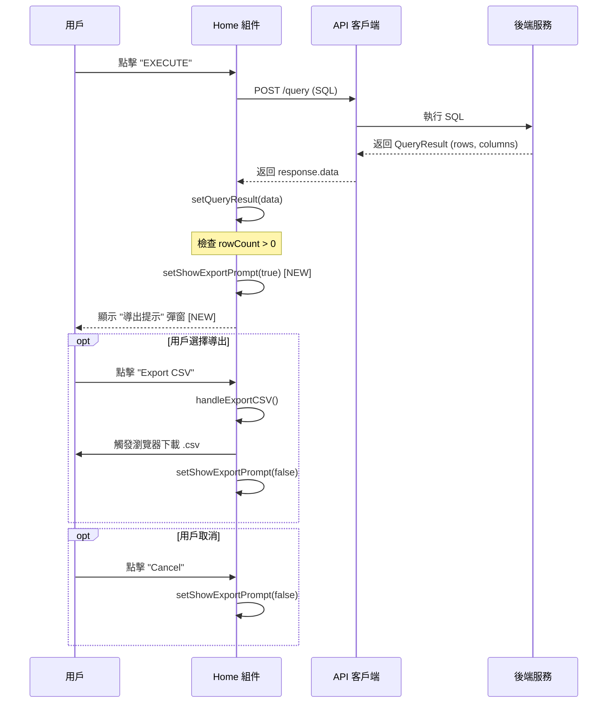

# 數據查詢工具導出功能設計文檔 (0001-design)

**作者**: Antigravity  
**日期**: 2026-02-03  
**狀態**: 擬定中 (Draft)

## 目錄

1. [引言](#1-引言)
2. [系統架構](#2-系統架構)
3. [詳細設計](#3-詳細設計)
4. [組件圖](#4-組件圖)
5. [時序圖](#5-時序圖)
6. [UI 設計](#6-ui-設計)

---

## 1. 引言

本設計文檔詳細說明了在 `w2/db_query` 項目中新增 "查詢後自動提示導出" 功能的技術實現方案。該功能旨在幫助用戶在查詢數據後，主動提示用戶保存數據為 CSV 或 JSON 格式。

## 2. 系統架構

本功能完全在前端實現，不涉及後端 API 的變更。

```mermaid
graph TD
    User[用戶] -->|輸入 SQL/自然語言| UI[前端界面 (React)]
    UI -->|發送請求| API[後端 API (FastAPI)]
    API -->|執行查詢| DB[(數據庫)]
    DB -->|返回數據| API
    API -->|返回 QueryResult| UI
    UI -->|自動觸發| Modal[導出提示彈窗]
    Modal -->|選擇 CSV/JSON| ExportLogic[前端導出邏輯]
    ExportLogic -->|生成文件| File[瀏覽器下載]
```

## 3. 詳細設計

### 3.1 核心邏輯

- **觸發時機**: 在查詢接口 (`/api/v1/dbs/{name}/query`) 調用成功，且返回數據行數 `rowCount > 0` 時。
- **狀態管理**:
  - `showExportPrompt`: `boolean`，控制彈窗顯示。
  - `lastQueryResult`: 緩存最後一次查詢結果（現已有 `queryResult`）。
- **文件生成**: 覆用現有的 `exportToCSV` 和 `exportToJSON` 函數，利用瀏覽器 `Blob` 和 `URL.createObjectURL` 實現下載。

### 3.2 接口定義

本功能不新增後端接口，僅調用現有接口：

- `POST /api/v1/dbs/{name}/query`: 執行 SQL 查詢。
- `POST /api/v1/dbs/{name}/query/natural`: 自然語言轉 SQL (不直接觸發導出，轉為 SQL 後需手動執行)。

## 4. 組件圖

前端組件結構及新增部分展示：

```mermaid
classDiagram
    class Home {
        +State: queryResult
        +State: showExportPrompt [NEW]
        +handleExecuteQuery()
        +handleExportCSV()
        +handleExportJSON()
        +render()
    }
    class SqlEditor {
        +value: string
        +onChange()
    }
    class ResultTable {
        +data: QueryResult
    }
    class ExportModal [NEW] {
        +visible: boolean
        +onCancel()
        +onExportCSV()
        +onExportJSON()
    }

    Home --> SqlEditor : 包含
    Home --> ResultTable : 包含
    Home --> ExportModal : 控制顯示
```

## 5. 時序圖

用戶執行查詢並觸發導出的完整流程：



## 6. UI 設計

### 6.1 導出提示彈窗 (Export Modal)

使用 Ant Design `Modal` 組件：

- **標題**: "Query Executed Successfully" (查詢執行成功)
- **內容**:
  - 顯示查詢摘要："Returned **150** rows in **45ms**."
  - 詢問文本："Do you want to export the results?"
- **按鈕**:
  - `Cancel`: 關閉彈窗。
  - `Export CSV`: 調用 `handleExportCSV` 並關閉彈窗。
  - `Export JSON`: 調用 `handleExportJSON` 並關閉彈窗。

### 6.2 手動按鈕

保持現有設計，位於結果卡片 (Result Card) 右上角：

- `[Export CSV]`
- `[Export JSON]`

## 7. 異常處理

- **無數據**: `rowCount === 0` 時，不彈出自動提示。
- **大數據量**: 如果數據量 `> 10000`，點擊導出時現有的 `Modal.confirm` 警告邏輯保持不變。在自動提示彈窗中點擊導出後，仍會觸發該警告，形成二級確認，防止瀏覽器卡死。

## 8. 實現計劃

1. 修改 `frontend/src/pages/Home.tsx`:
   - 引入 `Modal` 組件 (已有)。
   - 添加 `showExportPrompt`狀態。
   - 在 `handleExecuteQuery` 的 `try` 塊末尾添加 `setShowExportPrompt(true)`。
   - 在 `render` (return) 部分添加 Modal 的 JSX 代碼。
